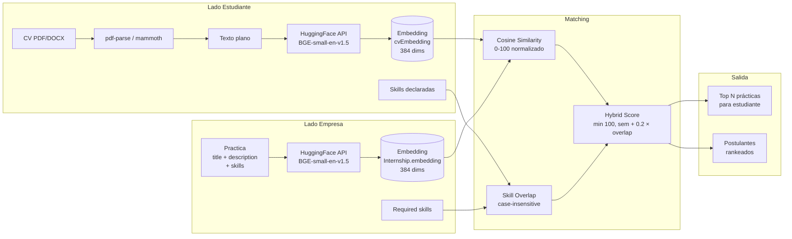
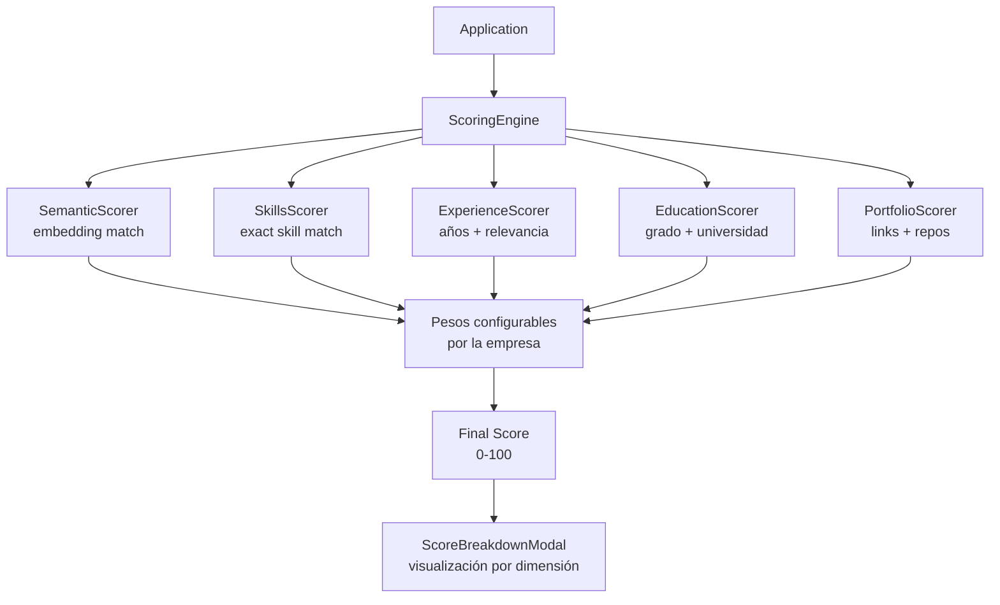
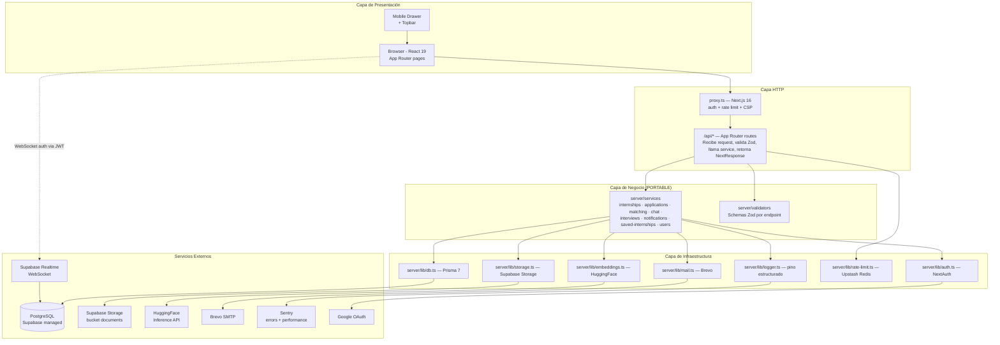
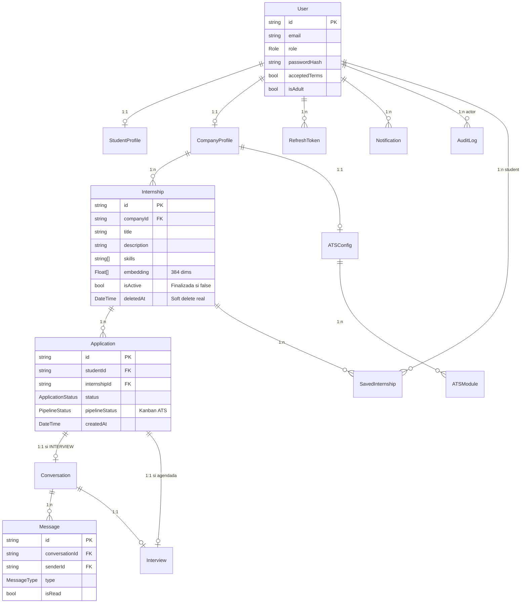
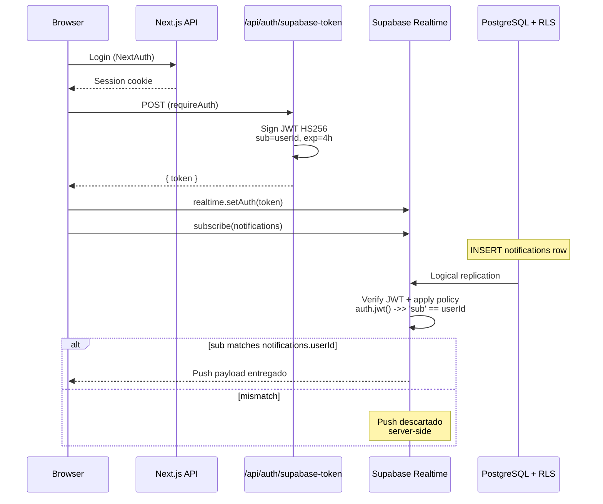
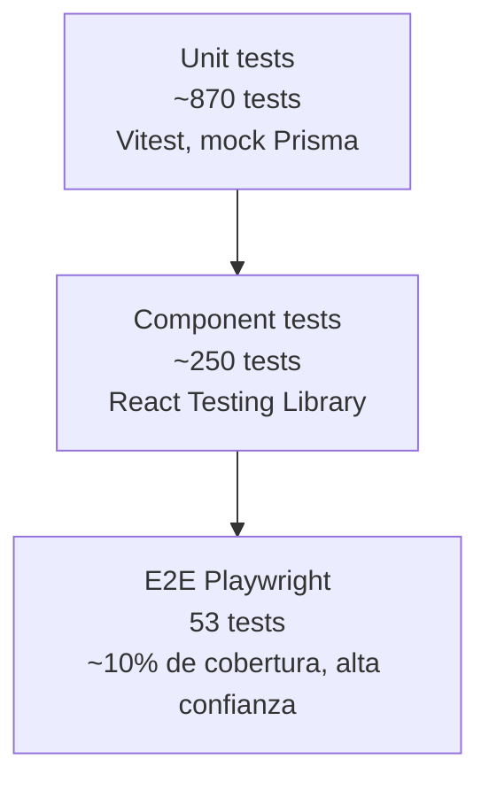
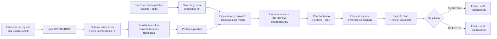

# PractiX

> Portal de prácticas laborales con **matching inteligente por IA** entre estudiantes y empresas.

[](https://github.com/FelipeAguirreA/web-master-proyecto/actions/workflows/ci.yml)
[](https://vercel.com)
[](https://nextjs.org)
[](https://www.typescriptlang.org)
[](#5--seguridad-y-calidad)
[](#5--seguridad-y-calidad)
[](#licencia)

PractiX es un **Trabajo Final de Máster en Desarrollo con IA** que resuelve un problema real del mercado laboral chileno: la asimetría entre estudiantes que buscan prácticas profesionales y empresas que reclutan talento joven sin herramientas adecuadas. La solución aplica **embeddings semánticos de NLP** _(Natural Language Processing — Procesamiento de Lenguaje Natural)_ para hacer matching entre el CV del estudiante y la descripción de cada práctica, complementado con un **scoring ponderado tipo ATS** _(Applicant Tracking System — sistema de seguimiento de candidatos)_ que las empresas configuran por puesto.

> Versión actual: **1.13.0** · Stack: **Next.js 16 + React 19 + TypeScript + Prisma 7 + Supabase + HuggingFace** · Deploy: **Vercel** + **PostgreSQL gestionado**.

---

## 📑 Índice

1. [El problema que resuelve](#1-el-problema-que-resuelve)
2. [Qué construí (alcance del MVP)](#2-qué-construí-alcance-del-mvp)
3. [🧠 Inteligencia Artificial aplicada](#3--inteligencia-artificial-aplicada)
4. [🏗️ Arquitectura técnica](#4-️-arquitectura-técnica)
5. [🔒 Seguridad y calidad](#5--seguridad-y-calidad)
6. [💼 Plan de negocio y monetización](#6--plan-de-negocio-y-monetización)
7. [🚀 Setup, ejecución y deploy](#7--setup-ejecución-y-deploy)
8. [📡 API y endpoints](#8--api-y-endpoints)
9. [🛣️ Roadmap post-TFM](#9-️-roadmap-post-tfm)
10. [📚 Documentación adicional](#10--documentación-adicional)

---

## 1. El problema que resuelve

### Contexto

En Chile, **más de 1,2 millones de estudiantes** cursan educación superior y la mayoría debe completar una práctica profesional para titularse. El proceso actual es manual, opaco y desigual:

- **Estudiante**: aplica a decenas de prácticas via portales genéricos (Chiletrabajos, Computrabajo, Trabajando) o LinkedIn, sin saber cuáles realmente encajan con su perfil. Recibe pocas respuestas porque su CV "se pierde" entre cientos de postulantes irrelevantes.
- **Empresa**: recibe avalanchas de CVs sin ranking. Una PyME que publica una práctica de desarrollador puede recibir 80 postulaciones — leer todas es inviable. Termina seleccionando por nombre de universidad o referencia personal, perdiendo talento real.
- **Mercado**: los portales generalistas optimizan para empleos full-time. Las prácticas de 3-6 meses con sueldos menores se diluyen y nadie las trata como un problema distinto.

### Público objetivo

| Lado            | Perfil concreto                                                                                                                                                              |
| --------------- | ---------------------------------------------------------------------------------------------------------------------------------------------------------------------------- |
| **Estudiantes** | 18-26 años, cursando últimos semestres en universidades chilenas. Sin experiencia laboral previa formal. Tienen CV en PDF/DOCX pero no saben cómo destacar.                  |
| **Empresas**    | PyMEs chilenas (10-200 empleados) que reclutan 1-5 practicantes al año. Sin equipo dedicado de RRHH, sin presupuesto para Workday/Greenhouse. Buscan algo simple y efectivo. |

### Por qué los portales actuales NO resuelven esto

| Portal        | Modelo                         | Problema para prácticas                               |
| ------------- | ------------------------------ | ----------------------------------------------------- |
| Chiletrabajos | Job board generalista          | No discrimina prácticas vs full-time, sin matching IA |
| Computrabajo  | Job board + ATS pago           | Pricing pensado para empresas grandes, opaco          |
| LinkedIn      | Red profesional                | Optimizado para senior hires, no para entrada         |
| Trabajando    | Hibrido (subscription + packs) | Cobra IA como upgrade ($+15.000 CLP/mes)              |

### La oportunidad

Construir un **portal vertical de prácticas con IA como diferenciador core** — no como add-on. Pricing accesible para PyMEs. UX optimizada para los flujos específicos de práctica (ATS chico, calendar simple, chat directo).

---

## 2. Qué construí (alcance del MVP)

PractiX es un **SaaS B2B2C** _(Business-to-Business-to-Consumer: las empresas pagan la suscripción, los estudiantes usan el producto gratis — mismo modelo que LinkedIn Recruiter, Uber Eats o Shopify)_ **en producción**, con dos productos cara al usuario y un panel admin:

### Para estudiantes

- Registro y perfil unificado con consentimiento etario obligatorio (Ley 21.719)
- Subida de CV (PDF/DOCX) con parsing automático y generación de embedding
- Listado público de prácticas con filtros (área, ubicación, modalidad, búsqueda)
- **Recomendaciones IA personalizadas** rankeadas por match score
- Sistema de postulación con un click
- **Chat en tiempo real** con la empresa cuando la postulación avanza
- Wishlist "Mis guardadas" para volver a prácticas que les interesaron
- Notificaciones in-app + email (Brevo) en cada cambio relevante

### Para empresas

- Registro con verificación de RUT chileno (validación de DV)
- Aprobación admin requerida antes de publicar (`companyStatus: APPROVED`)
- CRUD completo de prácticas con **edit gateado** si ya hay postulantes
- **Soft delete real** (`deletedAt`) ortogonal a "Finalizada" (`isActive: false`) — preserva historial de candidatos
- **Pipeline ATS Kanban** (5 etapas: PENDING → REVIEWING → INTERVIEW → ACCEPTED/REJECTED)
- **Scoring engine de 5 dimensiones** configurables por puesto (Strategy Pattern)
- Calendario de entrevistas con send-to-chat
- Notificaciones automáticas + email al estudiante en avances
- Templates de chat para respuestas frecuentes
- Perfil de empresa público con logo, descripción y ofertas activas

### Para admin

- Aprobación / rechazo / suspensión de empresas
- Auditoría completa de cambios (compliance F-Legal-3.4 — forensic audit log)
- Bulk actions sobre empresas pendientes

### Cumplimiento legal incluido

- **Ley 21.719 chilena (datos personales)**: consentimiento explícito, ARCO+ (derecho de acceso, rectificación, cancelación, oposición), data retention policy documentada, log forense de cambios.
- **OWASP Top 10 mitigado**: rate limiting, CSP con nonces, JWT 15min + refresh rotation, RLS, anti-enumeration, ownership checks (ver [docs/security-audit-api.md](docs/security-audit-api.md)).

### Lo que NO está en el MVP (decisión consciente)

- ❌ Sistema de pagos / suscripciones (diferido a post-TFM, ver [§6](#6--plan-de-negocio-y-monetización))
- ❌ SSO/SAML enterprise (overkill para PyME, target inicial)
- ❌ Multi-tenancy / multi-recruiter (defer a Pro v2)
- ❌ App móvil nativa (web responsive cubre el 95% de casos)
- ❌ Integraciones con ATS existentes (Workday, Greenhouse) — público inicial no los usa

---

## 3. 🧠 Inteligencia Artificial aplicada

Esta es la **sección central del proyecto**. El TFM es de Máster en Desarrollo con IA, así que acá explico en profundidad cómo se aplica IA real (no juguete) al problema concreto del matching.

### Aproximación elegida

**Embeddings semánticos + cosine similarity + boost híbrido por skill overlap**, en lugar de keyword matching tradicional (TF-IDF/BM25).

**Por qué semántica y no keywords**:

| Approach                  | Limitación                       | Caso real                                                                         |
| ------------------------- | -------------------------------- | --------------------------------------------------------------------------------- |
| TF-IDF / BM25             | No captura sinónimos ni contexto | "desarrollador" ≠ "programador"                                                   |
| Keyword exact             | Falsos negativos masivos         | "React" no matchea "ReactJS" o "React.js"                                         |
| **Embeddings semánticos** | Captura sentido                  | "Frontend developer junior" matchea CVs que dicen "Diseñé interfaces en HTML/CSS" |

### Stack de IA

| Componente                | Decisión                                   | Justificación                                                                                                                                   |
| ------------------------- | ------------------------------------------ | ----------------------------------------------------------------------------------------------------------------------------------------------- |
| **Modelo de embeddings**  | `BAAI/bge-small-en-v1.5` (HuggingFace)     | 384 dimensiones (storage manejable), top MTEB Retrieval entre modelos pequeños, soporta feature-extraction nativa en HF Inference API free tier |
| **Inference**             | HuggingFace Inference API                  | Sin presupuesto para OpenAI/Cohere; free tier sirve para el MVP                                                                                 |
| **CV parsing**            | `pdf-parse` para PDF + `mammoth` para DOCX | Cubren 99% de CVs reales                                                                                                                        |
| **Storage de embeddings** | `Float[]` en PostgreSQL via Prisma         | 384 dims × 8 bytes ≈ 3 KB por registro, manejable. Migración a pgvector cuando supere ~10k prácticas                                            |
| **Métrica de similitud**  | Cosine similarity normalizada (0-100)      | Estándar de la industria para embeddings, invariante a magnitud                                                                                 |
| **Boost híbrido**         | Adición capeada por skill overlap          | Permite a estudiantes sin CV todavía recibir match si declaran skills                                                                           |

> 📄 **Decisión documentada en**: [ADR 006 — Matching con embeddings HuggingFace + cosine similarity](docs/adr/006-matching-embeddings-huggingface.md)

### Pipeline de matching end-to-end



### Fórmula del score híbrido

```ts
// src/server/lib/embeddings.ts
function calculateHybridMatchScore(
  studentEmb: number[],
  jobEmb: number[],
  studentSkills: string[],
  requiredSkills: string[],
): number {
  const semantic = cosineSimilarityNormalized(studentEmb, jobEmb); // 0-100
  const overlap = computeSkillOverlap(studentSkills, requiredSkills); // 0-100
  return Math.min(100, semantic + (overlap / 100) * 20);
}
```

**Diseño deliberado**: boost ADITIVO (nunca penaliza). Si un estudiante declara una skill que matchea, su score SUBE. Si no declara nada, queda con el cosine puro. **Nunca baja por algo que el estudiante "no tiene"** — eso evita el sesgo de penalizar perfiles atípicos pero relevantes.

### ATS Scoring Engine (Strategy Pattern)

Para empresas, el score base se enriquece con **5 scorers especializados** que la empresa configura por puesto:



**Patrón aplicado**: **Strategy + Registry** (ver [docs/adr/006](docs/adr/006-matching-embeddings-huggingface.md) y [docs/specs/ats-scoring.spec.md](docs/specs/ats-scoring.spec.md)). Cada scorer implementa la interfaz `Scorer` y se registra en un mapa. La empresa elige los pesos via UI:

```
SemanticScorer   ──┐
SkillsScorer     ──┤
ExperienceScorer ──┼──>  finalScore = Σ (w_i × score_i)
EducationScorer  ──┤
PortfolioScorer  ──┘
```

Esto permite que una empresa de marketing pondere más Education+Portfolio, y una de ingeniería pondere más Skills+Experience, **sin tocar código**.

### Detalles de implementación clave

- **Embedding lazy generation**: solo se genera el embedding de la práctica al crearla. Se regenera **inteligentemente** en updates solo si cambian `title`/`description`/`skills` (diff real contra DB, no `!== undefined`).
- **Fallback graceful**: si HuggingFace API falla (cold start, rate limit), el embedding queda como `[]` y la práctica sigue siendo postulable — solo queda fuera del ranking IA hasta que se regenere.
- **Punto de swap de provider**: `src/server/lib/embeddings.ts` está marcado con comentario `// PUNTO DE SWAP DE PROVIDER` para facilitar migración futura a OpenAI text-embedding-3 o modelo self-hosted sin refactor masivo.
- **Costo ~$0**: HuggingFace Inference API free tier soporta el MVP. Migración a OpenAI/pgvector solo cuando el volumen lo justifique.

> 📄 **Spec detallada**: [docs/specs/matching.spec.md](docs/specs/matching.spec.md)

---

## 4. 🏗️ Arquitectura técnica

### Clean Architecture dentro de Next.js

El proyecto sigue **Clean Architecture** adaptada al monolito Next.js: capas concéntricas con regla estricta de dependencia hacia adentro. La lógica de negocio (`server/services/`) es **portable** — si mañana se migra a Express, se copia esa carpeta y funciona sin cambios.



### Regla de oro

**`server/services/` NO importa nada de `next` ni `next/server`.** Esto se verifica en cada PR via lint + tests. La capa de negocio es agnóstica al transporte HTTP.

### Stack completo

| Categoría      | Tecnología                  | Versión      | Razón                                               |
| -------------- | --------------------------- | ------------ | --------------------------------------------------- |
| Framework      | Next.js + App Router        | 16.2.6       | SSR + API routes + edge runtime                     |
| UI             | React + Tailwind CSS v4     | 19.2.5 / 4.x | Reactividad + utility-first styling                 |
| Lenguaje       | TypeScript                  | 5.x          | Type safety en services + validadores               |
| ORM            | Prisma                      | 7.8.0        | Type-safe queries + migrations versionadas          |
| DB             | PostgreSQL via Supabase     | 15+          | Managed, con Realtime y RLS                         |
| Auth           | NextAuth.js                 | 4.24.14      | Google OAuth (estudiantes) + credentials (empresas) |
| JWT signing    | jose                        | 6.2.3        | HS256 para Supabase Realtime auth (ADR 007)         |
| Embeddings IA  | HuggingFace Inference API   | —            | `BAAI/bge-small-en-v1.5`                            |
| Storage        | Supabase Storage            | —            | Bucket `documents` para CVs                         |
| Email          | Brevo                       | 10.x         | Transaccional, free tier 300/día                    |
| Rate limit     | Upstash Redis serverless    | 1.38.0       | Distribuido para serverless multi-instancia         |
| Observabilidad | pino + Sentry               | 10.x / 10.53 | Logs estructurados + APM + releases ligados a SHA   |
| Testing        | Vitest + Playwright         | 4.x / 1.59   | Unit/component + E2E                                |
| Deploy         | Vercel                      | —            | Build + edge + cron + analytics                     |
| CI/CD          | GitHub Actions + Dependabot | —            | Lint + types + tests + build + audit + agrupado     |

### Modelo de datos



**Decisiones de schema notables**:

- `Application.@@unique([studentId, internshipId])` → un estudiante no postula dos veces a la misma práctica.
- `Internship.deletedAt: DateTime?` → **soft delete real**, ortogonal a `isActive`. `isActive: false` significa "Finalizada" (sigue visible histórico); `deletedAt != null` significa "Eliminada" (no aparece en listados públicos, pero el owner sí la ve en tab "Eliminadas").
- Embeddings como `Float[]` (384 dims): viable hasta ~10k registros. Plan de migración a `pgvector + HNSW` documentado.
- 14 tablas con **RLS activado** (Row Level Security) — defensa en profundidad a nivel DB (ver §5).

### Convención de migraciones

Schema versionado en `prisma/migrations/<timestamp>_<descripcion>/migration.sql`. Vercel ejecuta `prisma migrate deploy` automáticamente en cada build. **Zero acción manual** en producción.

---

## 5. 🔒 Seguridad y calidad

La calidad del código es la primera promesa que cumple PractiX: **cero vulnerabilidades activas, 100% de cobertura funcional, 1.126 tests verde en cada commit a master, y auditoría OWASP Top 10 completa** con sus 31 findings críticos resueltos. Las decisiones de seguridad están documentadas en ADRs y verificadas por CI en cada PR.

### Métricas de calidad

| Métrica                       | Valor actual        | Estándar                            |
| ----------------------------- | ------------------- | ----------------------------------- |
| Tests unitarios + componente  | **1.126 passing**   | Vitest                              |
| Tests E2E                     | **53 passing**      | Playwright                          |
| Coverage funciones            | **100%**            | Threshold CI                        |
| Coverage líneas               | **80%**             | Threshold CI                        |
| Coverage branches             | **80%**             | Threshold CI                        |
| Vulnerabilidades de seguridad | **0 high/critical** | `pnpm audit --audit-level=moderate` |
| ESLint warnings/errors        | **0**               | Husky pre-commit                    |
| ADRs documentados             | **7**               | `docs/adr/`                         |
| Runbooks operacionales        | **4**               | `docs/runbooks/`                    |

### Seguridad — OWASP Top 10

| OWASP # | Riesgo                    | Mitigación implementada                                                                         |
| ------- | ------------------------- | ----------------------------------------------------------------------------------------------- |
| A01     | Broken Access Control     | `requireAuth(role?)` en `auth-guard.ts` + ownership checks en services + middleware `proxy.ts`  |
| A02     | Cryptographic Failures    | JWT HS256 firmados con secret de 32+ chars, bcrypt para passwords, JWT 15min + refresh rotation |
| A03     | Injection                 | Prisma parameterized queries + Zod validators en cada endpoint                                  |
| A04     | Insecure Design           | Clean Architecture + ADRs documentando trade-offs                                               |
| A05     | Security Misconfiguration | CSP con nonces dinámicos, HSTS, X-Frame-Options, COOP en `next.config.ts`                       |
| A07     | Auth Failures             | Revoke refresh tokens en password reset + anti-enumeration en forgot/login                      |
| A08     | Software/Data Integrity   | Audit completo `/api/*` (12 áreas, 31 findings 🛑 + 14 ⚠️ fixeados)                             |
| A09     | Logging Failures          | Pino estructurado + correlation ID `x-request-id` + Sentry releases ligados a commit            |
| A10     | SSRF                      | Sentry sanitization de URLs en errores                                                          |

> 📄 **Audit completo**: [docs/security-audit-api.md](docs/security-audit-api.md)

### Row Level Security (RLS) en PostgreSQL

**Defensa en profundidad a nivel base de datos**. Las 14 tablas del schema `public` tienen RLS habilitado:



**Estructura de policies**:

- **11 tablas backend-only** (sin policies): comportamiento default-deny. Prisma usa service role que bypasea RLS. Anon key del browser queda 100% bloqueada.
- **3 tablas con SELECT policies** (`conversations`, `messages`, `notifications`): permiten que Supabase Realtime entregue pushes solo al participante correcto via `auth.jwt() ->> 'sub'` (CUID, no UUID).

> 📄 **Decisión completa**: [ADR 007 — RLS en todas las tablas + JWT HS256](docs/adr/007-rls-realtime-jwt-hs256.md)

### Observabilidad

- **Logs estructurados** con `pino` + correlation ID `x-request-id` propagado en cada request.
- **Sentry** con releases ligados a `VERCEL_GIT_COMMIT_SHA`, `tracesSampleRate: 0.1`, 3 alertas configuradas, sourcemaps subidos en cada deploy.
- **3 runbooks operacionales** en `docs/runbooks/` para incidentes (auth down, DB slow, HuggingFace down, data breach).

### CI/CD

```yaml
push o pull_request → master
├─ Lint (ESLint 9 flat config)
├─ Type-check (tsc --noEmit)
├─ Tests (1.126 unit + 53 E2E)
├─ Build (Next.js + Prisma generate)
└─ Audit (pnpm audit --audit-level=moderate)
└─ Dependabot agrupado (react, sentry, prisma, testing) — evita PR explosion
```

### Disciplina de merge — Branch Protection en `master`

El repositorio tiene un **Ruleset activo en la rama `master`** (GitHub Rulesets, sucesor moderno de Branch Protection) que fuerza un único flujo válido para llegar a producción. Los controles aplican incluso al owner del repo (sin bypass), por diseño.

**Reglas activas en master:**

| Regla                                                | Efecto                                                                                     |
| ---------------------------------------------------- | ------------------------------------------------------------------------------------------ |
| **Require a pull request before merging**            | Imposible `git push origin master` directo. Toda mutación pasa por PR.                     |
| **Require status checks to pass**                    | Imposible mergear si Lint, Tests, Build, Audit o Vercel están en rojo.                     |
| **Require branches to be up to date before merging** | Imposible mergear "passes en mi branch pero rompe en master" — fuerza pull antes de merge. |
| **Require conversation resolution before merging**   | Imposible mergear con comments del review sin resolver.                                    |
| **Block force pushes**                               | Imposible `git push --force` — la historia es inmutable.                                   |
| **Restrict deletions**                               | Imposible borrar la rama `master` por la web o CLI.                                        |
| **Require linear history**                           | Imposible meter merge commits — solo squash o rebase. Historia legible commit-a-commit.    |

**Por qué importa esto en este proyecto:**

- `vercel-build` corre `prisma migrate deploy` automáticamente con cada push a master → un push roto puede corromper la base de datos de producción. La protección bloquea ese escenario.
- Garantiza que **cada entrada en el historial de master corresponde a un PR squasheado con CI verde y diff revisado**.
- El propio autor del repo no puede saltearse el proceso por error humano (typo, rama equivocada, push apurado).

**Verificable vía API**:

```bash
gh api repos/FelipeAguirreA/web-master-proyecto/rulesets \
  --jq '.[] | {name, enforcement, target}'
# {"name":"master","enforcement":"active","target":"branch"}
```

### Testing strategy — pirámide de Mike Cohn



> 📄 **Estrategia detallada**: [ADR 004 — Testing strategy](docs/adr/004-testing-strategy-piramide.md)

### Compliance Ley 21.719 (Chile)

- ✅ Consentimiento explícito en registro (`acceptedTerms`, `isAdult`)
- ✅ ARCO+ endpoints: `/api/users/me/export-data` (portabilidad) + `DELETE /api/users/me` (cancelación con cascada)
- ✅ Política de retención de datos documentada (`docs/data-retention-policy.md`)
- ✅ Forensic audit log de mutaciones sensibles (tabla `AuditLog`)
- ✅ Runbook de data breach (`docs/runbooks/incident-data-breach.md`)
- ✅ Sentry sanitization de PII (email, IP, query strings)

---

## 6. 💼 Plan de negocio y monetización

> Esta sección documenta la **estrategia diseñada pero NO implementada** en el MVP. La implementación se defiere a post-defensa del TFM para mantener foco en la calidad técnica del entregable.

### Análisis del mercado chileno (mayo 2026)

Investigación de competidores directos en Chile:

| Competidor          | Modelo                    | Precio referencia                                            | Limitación                              |
| ------------------- | ------------------------- | ------------------------------------------------------------ | --------------------------------------- |
| **Chiletrabajos**   | Subscription              | Plan Pyme $33.399/mes (anual) — Plan Business $107.038/mes   | Sin matching IA en plan base            |
| **Trabajando.cl**   | Híbrido                   | $69.900-$1.275.000 por bolsa de avisos · IA es upgrade +$15K | Pricing complejo, opaco para PyME chica |
| **Computrabajo CL** | Free + Packs + Membership | Pricing oculto, sales-led                                    | Sin self-serve para PyME                |
| **LinkedIn**        | Subscription              | $400+/mes                                                    | Genérico, no para prácticas             |

### Posicionamiento de PractiX

- **Target Etapa 1** (0-6 meses): PyME chilena (10-200 empleados), self-serve, sin sales team.
- **Diferenciador #1**: matching IA real CORE en el producto (no upgrade).
- **Diferenciador #2**: precio 55-83% por debajo del mercado.
- **Diferenciador #3**: nicho de prácticas (no full-time roles diluidos).

### Modelo de pricing (freemium con penetration pricing)

```
🟢 FREE (gratis para siempre)
   ├─ 1 práctica activa simultánea
   ├─ Ver postulantes + descargar CV
   ├─ Chat con candidatos (mini-pipeline 2 stages)
   ├─ Match score MENCIONADO pero LOCKEADO (patrón LinkedIn)
   ├─ Notificaciones email + in-app
   └─ Branding básico

🟠 PRO ($14.900 CLP/mes o $149.000/año con 17% off)
   ├─ TODO lo del Free, PLUS:
   ├─ Prácticas ILIMITADAS simultáneas        ← upgrade trigger principal
   ├─ ATS completo (kanban 5 stages)
   ├─ Score BREAKDOWN ATS (5 scorers visualizados)
   ├─ Calendario de entrevistas con send-to-chat
   ├─ Práctica DESTACADA en /practicas
   ├─ Branding extendido (logo grande, descripción)
   ├─ Templates de email
   └─ Export CSV de candidatos
```

### Comparativa vs mercado

| Plan                              | Precio mensual | vs Chiletrabajos Pyme | vs Trabajando 1 aviso + IA |
| --------------------------------- | -------------- | --------------------- | -------------------------- |
| **PractiX Pro mensual**           | **$14.900**    | **55% más barato**    | **83% más barato**         |
| **PractiX Pro anual equivalente** | **$12.417**    | **63% más barato**    | **86% más barato**         |

### Política de reembolso

- **14 días money-back guarantee** (refund total).
- Después de 14 días: acceso garantizado hasta fin del período pagado, sin reembolso del dinero ya cobrado.
- Excepción case-by-case para casos legítimos (empresa cerró, problema real del producto).
- Marco legal: PractiX es B2B, no aplica derecho a retracto de Ley 19.496.

### Método de pago

**Mercado Pago Chile** para arrancar (setup rápido, suscripciones nativas, aceptado por PyMEs). Webpay (Transbank) queda diferido a fase posterior cuando haya brand recognition.

### Roadmap de monetización secuencial

| Etapa | Horizonte | Segmento foco             | Por qué                                                     |
| ----- | --------- | ------------------------- | ----------------------------------------------------------- |
| **1** | 0-6 m     | PyME chilena              | Producto ya encaja sin features extra; ciclo de venta corto |
| **2** | 6-12 m    | Universidades chilenas    | Venta consultiva con case studies de Etapa 1                |
| **3** | 12-24 m   | Corporativos grandes (CL) | Requiere SSO/SAML, compliance ISO, multi-recruiter          |
| **4** | 24+ m     | Empresas extranjeras      | Requiere i18n, multi-currency, GDPR, soporte multi-TZ       |

### Razón de diferir implementación al post-TFM

1. **Criterios del TFM no incluyen "implementaste billing"**. Lo que evalúan: arquitectura, IA, calidad, seguridad, visión.
2. **Mercado Pago + paywall son 3-4 semanas de trabajo real** con riesgo de bugs en demo.
3. **Free-for-all permite al jurado explorar TODO el sistema sin fricción**.
4. **Estrategia documentada > estrategia mal implementada** para evaluación académica.

---

## 7. 🚀 Setup, ejecución y deploy

### Requisitos

- Node 20+
- pnpm 10+
- Docker (para PostgreSQL local)
- Cuentas en: Supabase, HuggingFace, Google Cloud Console, Brevo

### Instalación local

```bash
# 1. Clonar
git clone https://github.com/FelipeAguirreA/web-master-proyecto.git practix
cd practix

# 2. Dependencias
pnpm install

# 3. Variables de entorno
cp .env.example .env.local
# Editar .env.local con tus credenciales (ver tabla abajo)

# 4. PostgreSQL local
docker compose up -d
# (el contenedor mapea puerto 5433 para no chocar con Postgres del SO host)

# 5. Migrations + seed
pnpm prisma migrate dev   # aplica todas las migrations versionadas
pnpm db:seed              # datos de ejemplo

# 6. Dev server
pnpm dev
# → http://localhost:3000
```

### Variables de entorno

| Variable                        | Descripción                                                        | Dónde obtenerla                                                   |
| ------------------------------- | ------------------------------------------------------------------ | ----------------------------------------------------------------- |
| `DATABASE_URL`                  | PostgreSQL connection string (Prisma queries)                      | Supabase → Settings → Database → Transaction Pooler (puerto 6543) |
| `DIRECT_URL`                    | Conexión directa para migrations (la CLI necesita esto)            | Supabase → Settings → Database → Direct connection (puerto 5432)  |
| `NEXT_PUBLIC_SUPABASE_URL`      | URL del proyecto Supabase                                          | Supabase → Settings → API                                         |
| `NEXT_PUBLIC_SUPABASE_ANON_KEY` | Anon key pública (browser usa esto para Realtime WebSocket)        | Supabase → Settings → API                                         |
| `SUPABASE_SERVICE_KEY`          | Service role key (backend, bypasea RLS)                            | Supabase → Settings → API                                         |
| `SUPABASE_JWT_SECRET`           | Legacy JWT secret (firma HS256 para Realtime auth con RLS)         | Supabase → Settings → API → JWT Keys → tab "Legacy JWT Secret"    |
| `NEXTAUTH_URL`                  | URL base de la app                                                 | `http://localhost:3000` en dev, URL Vercel en prod                |
| `NEXTAUTH_SECRET`               | Secret para firmar tokens NextAuth (mín 32 chars)                  | `openssl rand -base64 32`                                         |
| `GOOGLE_CLIENT_ID`              | OAuth Client ID                                                    | Google Cloud Console → APIs & Services → Credentials              |
| `GOOGLE_CLIENT_SECRET`          | OAuth Client Secret                                                | Google Cloud Console → Credentials                                |
| `HUGGINGFACE_API_KEY`           | Token de HuggingFace (Inference API)                               | huggingface.co → Settings → Access Tokens                         |
| `BREVO_API_KEY`                 | API key para emails transaccionales                                | Brevo → Settings → SMTP & API → API Keys                          |
| `BREVO_SENDER_EMAIL`            | Email del remitente (verificado en Brevo)                          | Brevo dashboard                                                   |
| `NEXT_PUBLIC_SENTRY_DSN`        | DSN de Sentry (opcional)                                           | sentry.io → Project → Client Keys                                 |
| `UPSTASH_REDIS_REST_URL`        | Redis serverless para rate limiting (opcional, fallback in-memory) | Upstash Console                                                   |
| `UPSTASH_REDIS_REST_TOKEN`      | Token REST del Redis (par del anterior)                            | Upstash Console                                                   |

### Comandos disponibles

```bash
pnpm dev                                # Dev server → http://localhost:3000
pnpm lint                               # ESLint (debe ser 0 errors)
pnpm test                               # Vitest unit tests (watch mode)
pnpm test:coverage                      # Coverage con threshold (100% func / 80% lines)
pnpm test:e2e                           # Playwright E2E (requiere dev server corriendo)
pnpm prisma migrate dev --name <desc>   # Nueva migration versionada
pnpm prisma migrate status              # Ver migrations pendientes
pnpm db:generate                        # Regenerar Prisma Client
pnpm db:studio                          # GUI para inspeccionar datos
pnpm db:seed                            # Seed de datos de ejemplo
pnpm docker:dev                         # PostgreSQL local (puerto 5433)
```

### Deploy en Vercel

1. Subir el repo a GitHub.
2. [vercel.com](https://vercel.com) → Add New Project → importar repo.
3. Framework: **Next.js** (auto-detectado).
4. Agregar todas las variables de entorno del cuadro anterior en Vercel → Project Settings → Environment Variables (tanto Preview como Production).
5. Click **Deploy**.
6. Post-deploy: agregar `https://<tu-app>.vercel.app/api/auth/callback/google` como redirect URI autorizado en Google Cloud Console.

`prisma migrate deploy` corre automáticamente en cada build de Vercel (ver script `vercel-build` en `package.json`).

---

## 8. 📡 API y endpoints

PractiX expone **49 rutas REST agrupadas en 8 áreas funcionales**. Por seguridad, esta sección no enumera los paths exactos — el detalle completo está en las specs por service (ver [§10 Documentación adicional](#10--documentación-adicional)).

### Resumen por área

| Área                                  | Cantidad | Responsabilidad                                                                                       |
| ------------------------------------- | -------- | ----------------------------------------------------------------------------------------------------- |
| **Auth**                              | 7        | Login Google/credentials, refresh tokens, forgot/reset password, firma JWT HS256 para Realtime        |
| **Users / Profile / Perfil**          | 6        | CRUD perfil estudiante/empresa, avatar, perfil unificado                                              |
| **Internships**                       | 4        | CRUD prácticas, soft delete con `deletedAt`, edit gateado por postulantes, ?includeDeleted para owner |
| **Applications**                      | 5        | Postular, listar postulaciones, ver postulantes, cambiar estado                                       |
| **ATS**                               | 4        | Config scorers por puesto, pipeline kanban, ranking de candidatos, score breakdown                    |
| **Matching IA**                       | 2        | Subir CV + generar embedding, recomendaciones rankeadas por cosine similarity                         |
| **Chat / Interviews / Notifications** | 10       | Conversaciones, mensajes paginados, unread count, calendario entrevistas, send-to-chat, bell          |
| **Admin**                             | 2        | Aprobación / rechazo / suspensión de empresas                                                         |
| **Health**                            | 1        | Estado del servidor + ping a DB                                                                       |

### Garantías transversales

Todas las rutas comparten estas capas de defensa:

1. **Middleware** `proxy.ts` aplica rate limiting (Upstash Redis) y CSP con nonces dinámicos antes que cualquier handler.
2. **Auth guard**: las rutas autenticadas pasan por `requireAuth(role?)` — devuelve `401` si no hay sesión válida o `403` si el rol no matchea.
3. **Validación de body**: las rutas que aceptan payload validan con **schemas Zod estrictos** (`src/server/validators/`). Errores devuelven `400` con detalles tipados, sin exponer info de Prisma.
4. **Ownership**: las rutas que mutan datos ajenos verifican propiedad en el service (helpers `findOwned*`). Devuelven `404` anti-enumeration en lugar de `403` cuando el recurso no pertenece al user.
5. **Manejo de errores**: errores de negocio mapeados a códigos HTTP específicos (`APPLICATIONS_EXIST` → `409`); errores inesperados → `500` genérico + Sentry capture con sanitización de PII.
6. **Rate limiting**: rutas sensibles (login, reset password, registro) tienen límites estrictos via Upstash distribuido.

### Acceso al detalle de cada endpoint

Cada service tiene su **spec SDD** en `docs/specs/` que documenta input/output, casos de error, reglas de negocio y casos borde de **cada función** del service. La spec es el contrato — el código la cumple, los tests la verifican. Esto reemplaza una enumeración pública de paths con documentación contextual mucho más rica.

---

## 9. 🛣️ Roadmap post-TFM

### Fase A — Cierre del TFM (mayo 2026)

- ✅ Producto funcional, deployado, testeado, auditado
- ✅ 7 ADRs documentados, 1.126 tests verde, 0 vulns
- ⏳ Demo Loom 5-7 min del flujo end-to-end
- ⏳ NotebookLM Audio Overview del proyecto (asistente IA para defensa)
- ⏳ Defensa oral con jurado multidisciplinar

### Fase B — Monetización Etapa 1: PyME chilena (junio-noviembre 2026)

1. Implementar `subscriptionTier: FREE | PRO` en `CompanyProfile`
2. Paywall en `createInternship` para FREE tier (límite 1 práctica simultánea)
3. Refactor de `chat.service.ts` para soportar mini-pipeline 2 stages sin ATS completo
4. UI gating: lockear match score, ATS, calendar para FREE
5. Modal de upgrade en cada gate
6. Integración Mercado Pago Subscriptions + webhooks de billing
7. ToS + Política de Privacidad con cláusula de refund
8. Beta cerrada con 10 PyMEs amigas
9. Iteración basada en feedback real

### Fase C — Etapa 2: Universidades chilenas (12-18 meses)

- Bulk onboarding de estudiantes desde sistemas universitarios (Banner/SIU)
- Métricas de empleabilidad para reportes de acreditación
- Integración con LMS (Canvas, Moodle)
- Procurement pública (licitaciones para universidades estatales)

### Fase D — Etapa 3: Corporativos grandes (18-30 meses)

- SSO/SAML (Okta, Azure AD, Google Workspace)
- Multi-recruiter con permisos granulares
- Audit logs avanzados + compliance ISO 27001
- Custom contracts + MSA
- Integraciones con ATS legacy (Workday, Greenhouse, Lever)

### Fase E — Etapa 4: Empresas extranjeras (30+ meses)

- i18n completo (next-intl)
- Multi-currency (USD, EUR, MXN, BRL)
- GDPR compliance para usuarios europeos
- Soporte multi-timezone
- Métodos de pago internacionales (Stripe global)

### Mejoras técnicas continuas (cualquier momento)

- Migración a `pgvector` + índice HNSW cuando supere 10k prácticas
- Migración de embeddings a OpenAI `text-embedding-3-small` si calidad lo justifica
- RS256 + JWKS para Supabase Realtime cuando se upgradee a Pro tier
- F6.4 NFR P95 < 200ms con tráfico real (medición con `k6`/`autocannon`)
- F6.5 UX optimistic + skeletons en flujos críticos
- 2 alertas Sentry adicionales (error rate > 1%, P95 > 200ms) — esperando tier paga

---

## 10. 📚 Documentación adicional

### Architecture Decision Records (ADRs)

Decisiones arquitectónicas relevantes con contexto, alternativas evaluadas y consecuencias:

1. [ADR 001 — Monolito modular + Clean Architecture](docs/adr/001-monolito-modular-clean-architecture.md)
2. [ADR 002 — Autenticación con NextAuth + JWT rotativo](docs/adr/002-auth-nextauth-jwt-rotativo.md)
3. [ADR 003 — Rate limiting con Upstash Redis](docs/adr/003-rate-limiting-upstash.md)
4. [ADR 004 — Testing strategy — pirámide](docs/adr/004-testing-strategy-piramide.md)
5. [ADR 005 — Observabilidad con Sentry + logger estructurado](docs/adr/005-observabilidad-sentry-logger.md)
6. [ADR 006 — Matching con embeddings HuggingFace + cosine similarity](docs/adr/006-matching-embeddings-huggingface.md)
7. [ADR 007 — RLS en todas las tablas + Realtime auth con JWT HS256](docs/adr/007-rls-realtime-jwt-hs256.md)

### Specs SDD (Spec-Driven Development)

Contratos de los services principales:

- [applications.service.spec.md](docs/specs/applications.service.spec.md)
- [auth-guard.spec.md](docs/specs/auth-guard.spec.md)
- [ats-scoring.spec.md](docs/specs/ats-scoring.spec.md)
- [chat.service.spec.md](docs/specs/chat.service.spec.md)
- [csp.spec.md](docs/specs/csp.spec.md)
- [cv-parser.spec.md](docs/specs/cv-parser.spec.md)
- [db-cascades.spec.md](docs/specs/db-cascades.spec.md)
- [internships.service.spec.md](docs/specs/internships.service.spec.md)
- [interviews.service.spec.md](docs/specs/interviews.service.spec.md)
- [matching.spec.md](docs/specs/matching.spec.md)
- [rate-limit.spec.md](docs/specs/rate-limit.spec.md)
- [refresh-tokens.spec.md](docs/specs/refresh-tokens.spec.md)
- [users.service.spec.md](docs/specs/users.service.spec.md)

### Runbooks operacionales

Procedimientos paso a paso para incidentes:

- [Auth Down](docs/runbooks/incident-auth-down.md)
- [Data Breach](docs/runbooks/incident-data-breach.md)
- [DB Slow](docs/runbooks/incident-db-slow.md)
- [HuggingFace Down](docs/runbooks/incident-huggingface-down.md)

### Otros documentos relevantes

- [CHANGELOG.md](CHANGELOG.md) — Historial completo de cambios versionados (Keep a Changelog format)
- [CLAUDE.md](CLAUDE.md) — Guía de contribución y convenciones del proyecto
- [CHAT_MODULE.md](CHAT_MODULE.md) — Setup detallado del módulo chat + Realtime + RLS
- [context/project-state.md](context/project-state.md) — Snapshot del estado actual del proyecto
- [context/refactor-plan.md](context/refactor-plan.md) — Plan de refactor + hardening (Fases 0-6)
- [docs/data-retention-policy.md](docs/data-retention-policy.md) — Política de retención (Ley 21.719)
- [docs/security-audit-api.md](docs/security-audit-api.md) — Audit OWASP completo del backend
- [docs/sentry-alerts.md](docs/sentry-alerts.md) — Configuración de alertas

---

## 🎥 Demo

> **Demo en video (Loom)**: _[placeholder — se grabará y embebe acá antes de la defensa]_
>
> **Audio Overview (NotebookLM)**: _[placeholder — se generará a partir de este README + ADRs antes de la defensa]_

### Capturas representativas

> _Capturas se agregarán antes de la defensa. Por ahora, el sistema deployado está disponible en el Preview/Production de Vercel para exploración en vivo._

### Flujo end-to-end (descripción)



---

## 🧑‍🎓 Sobre este TFM

Este proyecto es el **Trabajo Final de Máster en Desarrollo con IA** de Felipe Aguirre. Combina:

- **Aplicación real de IA** (embeddings + cosine + hybrid scoring + Strategy pattern para ATS)
- **Arquitectura limpia y portable** (Clean Architecture dentro de Next.js)
- **Calidad de código profesional** (1.126 tests, 7 ADRs, 0 vulns, OWASP audit completo)
- **Visión de producto y negocio** (análisis competencia, pricing penetration, roadmap secuencial)
- **Cumplimiento legal real** (Ley 21.719 chilena de datos personales)

El código completo está en este repositorio bajo licencia MIT. Las decisiones técnicas se justifican en los ADRs. La estrategia de negocio está documentada acá (§6) basada en investigación real del mercado chileno mayo 2026.

---

## Licencia

**All rights reserved — Source-available for academic evaluation only.**

© 2026 Felipe Aguirre.

El código de este repositorio está disponible públicamente con un único propósito: **permitir la lectura, revisión y evaluación académica de este Trabajo Final de Máster**. No constituye software de código abierto.

### Permitido

- ✅ Leer, clonar y revisar el código para evaluación académica del TFM.
- ✅ Usar fragmentos puntuales como referencia educativa con cita explícita al autor.
- ✅ Estudiar las decisiones arquitectónicas documentadas en los ADRs.

### Prohibido sin autorización escrita del autor

- ❌ Uso comercial total o parcial del código, diseño, marca o estrategia.
- ❌ Despliegue como producto propio o derivado (incluso modificado).
- ❌ Redistribución del código fuente bajo cualquier licencia.
- ❌ Forks públicos con intención de continuación o competencia.
- ❌ Uso del nombre **PractiX**, su logo o marca asociada.

Para licenciamiento comercial, partnerships o cualquier uso fuera del alcance estrictamente académico, contactar al autor.

> _Para preguntas durante la evaluación del TFM, ver la sección [§10 Documentación adicional](#10--documentación-adicional) para enlaces a las specs, ADRs y runbooks que profundizan en cualquier área específica._
